# CarND-Semantic Segmentation Project
Self-Driving Car Engineer Nanodegree Program

## Project summary / write-up
by Michael Berner, Student @ Udacity, March 2018 class

[](http://www.udacity.com/drive)

-

### Overview
The task in this project was to create a **fully convolutional neural network** to perform semantic segmentation of image data. 

The goal was to detect "street" and "not-street" in image files. For training purposes, labeled image data was provided. Original dataset was the [Kitti Road dataset](http://www.cvlibs.net/datasets/kitti/eval_road.php) from Karlsruhe Institute of Technology KIT. Data was provided both as:

- Raw image data (taken from onboard camera) 
- Correspondingly labeled images (road / not road was labeled)

An example for both image types is shown below: 

[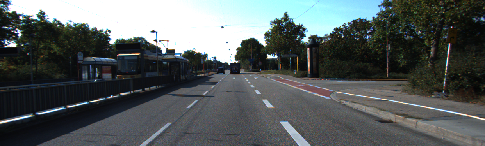](./media/intro_overview.png)

[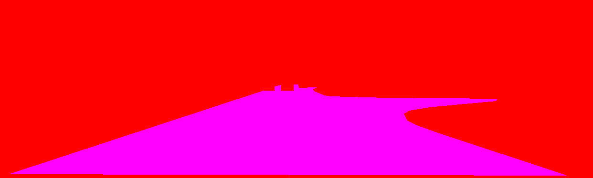](./media/intro_overview.png)

### Solution

The approach to create the fully convolutional neural network was based on a scientific paper from Berkeley, which is known as the [FCN-8 Architecture](https://people.eecs.berkeley.edu/~jonlong/long_shelhamer_fcn.pdf). 

As encoder part of the FCN, a VGG16 net is used, which was pretrained on ImageNet for classification.

It was necessary to develop the decoder part of the FCN and train the entire FCN on the KITTI dataset. The solution was created using TensorFlow. 

The following steps were carried out to achieve the result:

- Load the necessary parts of the pre-trained model
- Define the decoder layers in TensorFlow
- Feed in several layers from the encoder and perform a deconvolution
- Define optimizer
- Define a loss function
- Train the model for sufficient amount of epochs
- Optimize functions incl. hyperparameters

Training dataset and validation dataset was split in order to avoid the FCN to learn on the validation set as well. 

In the image below, an exemplary result is depicted.

[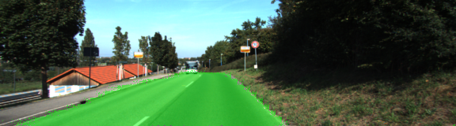](./media/result_um_000031.png)

At the edges of the road, there are still some pixel fragments and the shape is not perfectly smooth. But overall, the road was clearly detected. This is true for the majority of the validation images. 

A large [GIF file](./media/Output_v5.1_3.gif) (19.6MB) was created, showing the final results as a loop. The GIF file was excluded from the main readme page to optimize loading time. Feel free to take a look at it!


### Algorithm in final solution

Several options were evaluated. The following settings were picked, to create the final solution:

- Adam optimizer: adaptive learning rate, `learning_rate=0.00025`, other values TF standard
- L2 regularization: reduce over-fitting, `l2_reg_scale=0.001`
- Dropout: after encoder part, `keep-rate=0.8`
- Freezing of VGG16 encoder layers with `tf.stop_gradient(vgg_layer_N)` not used
- Initialization of the network with random normal values, `std_dev=0.1`
- Training parameters: `batch_size=5`, `epochs=60` 

Layers were reproduced analogous to [this publication](https://people.eecs.berkeley.edu/~jonlong/long_shelhamer_fcn.pdf) of Long, Shelhamer et al from UC Berkeley on fully convolutional neural networks. The image below originates from the same publication and can be found on page 5.  
[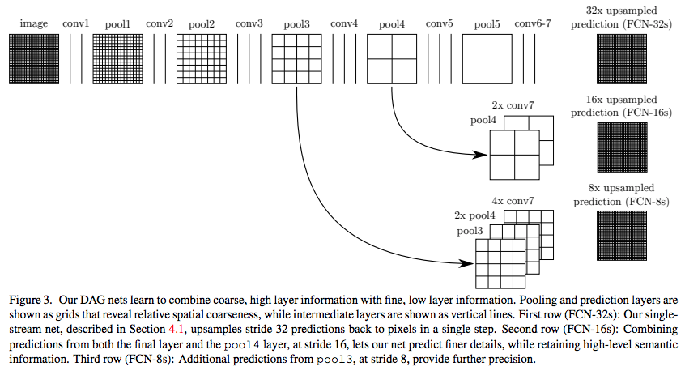](./media/Long_Shelhamer_FCN.png)

Since VGG16 was used as basis, only the decoder part of the network had to be built. In order to merge in the information from some layers of the encoder portion, the corresponding layers of the decoder part needed to be of the same size. This was the case for layers 7, 4 and 3.

The decoder part finally consisted of 4 layers with the following sizes:

- Decoder layer 1: size of layer 7 (enc), layer 7 (enc) fed in using `tf.add`
- Decoder layer 2: size of layer 4 (enc), layer 4 (enc) fed in using `tf.add`
- Decoder layer 3: size of layer 3 (enc), layer 3 (enc) fed in using `tf.add`
- Decoder layer 4: size of original image 

### Training

The entire project was done on Udacity's workspace. Udacity's workspace offers a NVidia Tesla GPU with 11GB of memory, which was sufficient for this project.

##### First attempts

The first version was not working properly. With a very low emount of epochs (three), the entire image was full of scattered positive detections. With a higher amount of epochs (30 epochs), it was full of negatives. 

[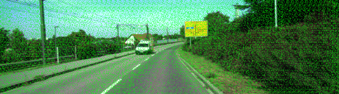](./media/res_v1-03_um_000036.png)

[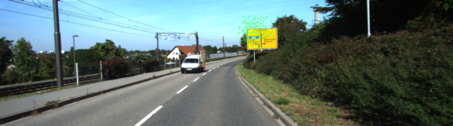](./media/res_v1-30_um_000036.png)

##### Third version: including level 2 regularization, standard normal initilization

A significant improvement was achieved by changing the learning rate (from 1e-3 to 1e-4) and adding level 2 regularization to the network. Initilization of the nodes was changed from truncated-normal to standard normal with standard deviation of 0.1. 

[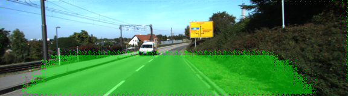](./media/res_v3.1-15_um_000036.png)


##### Fourth version: different learning rate, keep probability and impact of freezing the encoder layer
At this stage, learning rate was adapted to 2e-4 and keep probability increased from 0.5 to 0.8. Freezing of the encoder layers was tested, but did not yield suitable results, as shown below. With frozen encoder layers:

[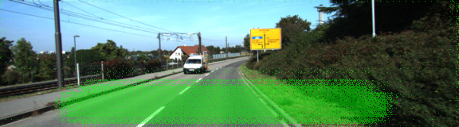](./media/res_v4.2-30_um_000036.png)

Without frozen encoder layers:  

[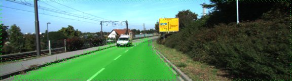](./media/res_v4.1-30_no-freeze_um_000036.png)

Conclusion so far: we are getting closer!

##### Fifth and final version: learning rate & more epochs

The learning rate was once more adapted to 2.5e-4. Finally, a much lower loss could be observed compared to previous versions. Therefore, the amount of epochs used for training was increased from 15 to 60. 

The result was quite satisfying. The loss decreased to 0.04 (compared to best solution so far only yielding 0.31). Loss was reduced at a much higher rate compared to the previous attempts.  

[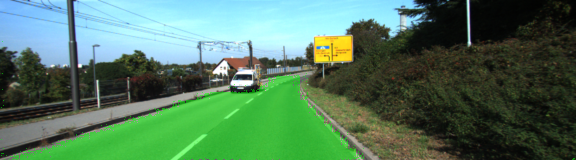](./media/res_v5.1_um_000036.png)


### Reflection / Possible improvements

In the final result, there were also images with wrong detections.

Below you can see an example for false positives, where the pedestrian pathway was detected as road. 

[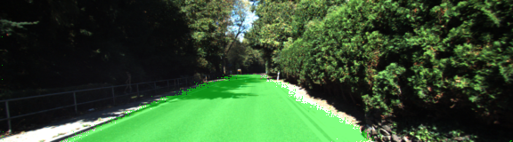](./media/result_false_pos_um_000094.png)

Cases with false negatives did also exist, mainly for bad lighting conditions with shadows on the road, as shown below. 

[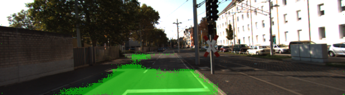](./media/result_false_neg_um_000070.png)

This leaves room for improvement.

Possible next steps to address these issues would be to increase the amount of such images in the training dataset (i.e. more images with shadows on the road & a not clearly visible pedestrian roadside).

This could either be done by recording more images of this type or by augmenting the available images of this type by a combination of 

- adjustment of brightness (lighter, darker)
- adjustment of contrast (more, less)
- adjustment of white balance (warmer, colder)
- flip images horizontally (left-right)

The amount of epochs used for training could be further increased, as well. Even at epoch 60, the loss was still decreasing noticably. It must be paid attention though to not overfit the FCN. 

### Summary

As for all projects, this one was again a lot of fun after initial challenges and taught me some important lessons. I learned a lot and thank Udacity for this great experience. 

I would have enjoyed to tweak this even further, but, as always, time is limited. 


-

## Original Readme by Udacity

### Introduction
In this project, you'll label the pixels of a road in images using a Fully Convolutional Network (FCN).

### Setup
##### GPU
`main.py` will check to make sure you are using GPU - if you don't have a GPU on your system, you can use AWS or another cloud computing platform.
##### Frameworks and Packages
Make sure you have the following is installed:
 - [Python 3](https://www.python.org/)
 - [TensorFlow](https://www.tensorflow.org/)
 - [NumPy](http://www.numpy.org/)
 - [SciPy](https://www.scipy.org/)
##### Dataset
Download the [Kitti Road dataset](http://www.cvlibs.net/datasets/kitti/eval_road.php) from [here](http://www.cvlibs.net/download.php?file=data_road.zip).  Extract the dataset in the `data` folder.  This will create the folder `data_road` with all the training a test images.

### Start
##### Implement
Implement the code in the `main.py` module indicated by the "TODO" comments.
The comments indicated with "OPTIONAL" tag are not required to complete.
##### Run
Run the following command to run the project:
```
python main.py
```
**Note** If running this in Jupyter Notebook system messages, such as those regarding test status, may appear in the terminal rather than the notebook.

### Submission
1. Ensure you've passed all the unit tests.
2. Ensure you pass all points on [the rubric](https://review.udacity.com/#!/rubrics/989/view).
3. Submit the following in a zip file.
 - `helper.py`
 - `main.py`
 - `project_tests.py`
 - Newest inference images from `runs` folder  (**all images from the most recent run**)
 
 ### Tips
- The link for the frozen `VGG16` model is hardcoded into `helper.py`.  The model can be found [here](https://s3-us-west-1.amazonaws.com/udacity-selfdrivingcar/vgg.zip).
- The model is not vanilla `VGG16`, but a fully convolutional version, which already contains the 1x1 convolutions to replace the fully connected layers. Please see this [post](https://s3-us-west-1.amazonaws.com/udacity-selfdrivingcar/forum_archive/Semantic_Segmentation_advice.pdf) for more information.  A summary of additional points, follow. 
- The original FCN-8s was trained in stages. The authors later uploaded a version that was trained all at once to their GitHub repo.  The version in the GitHub repo has one important difference: The outputs of pooling layers 3 and 4 are scaled before they are fed into the 1x1 convolutions.  As a result, some students have found that the model learns much better with the scaling layers included. The model may not converge substantially faster, but may reach a higher IoU and accuracy. 
- When adding l2-regularization, setting a regularizer in the arguments of the `tf.layers` is not enough. Regularization loss terms must be manually added to your loss function. otherwise regularization is not implemented.
 
### Using GitHub and Creating Effective READMEs
If you are unfamiliar with GitHub , Udacity has a brief [GitHub tutorial](http://blog.udacity.com/2015/06/a-beginners-git-github-tutorial.html) to get you started. Udacity also provides a more detailed free [course on git and GitHub](https://www.udacity.com/course/how-to-use-git-and-github--ud775).

To learn about REAMDE files and Markdown, Udacity provides a free [course on READMEs](https://www.udacity.com/courses/ud777), as well. 

GitHub also provides a [tutorial](https://guides.github.com/features/mastering-markdown/) about creating Markdown files.
